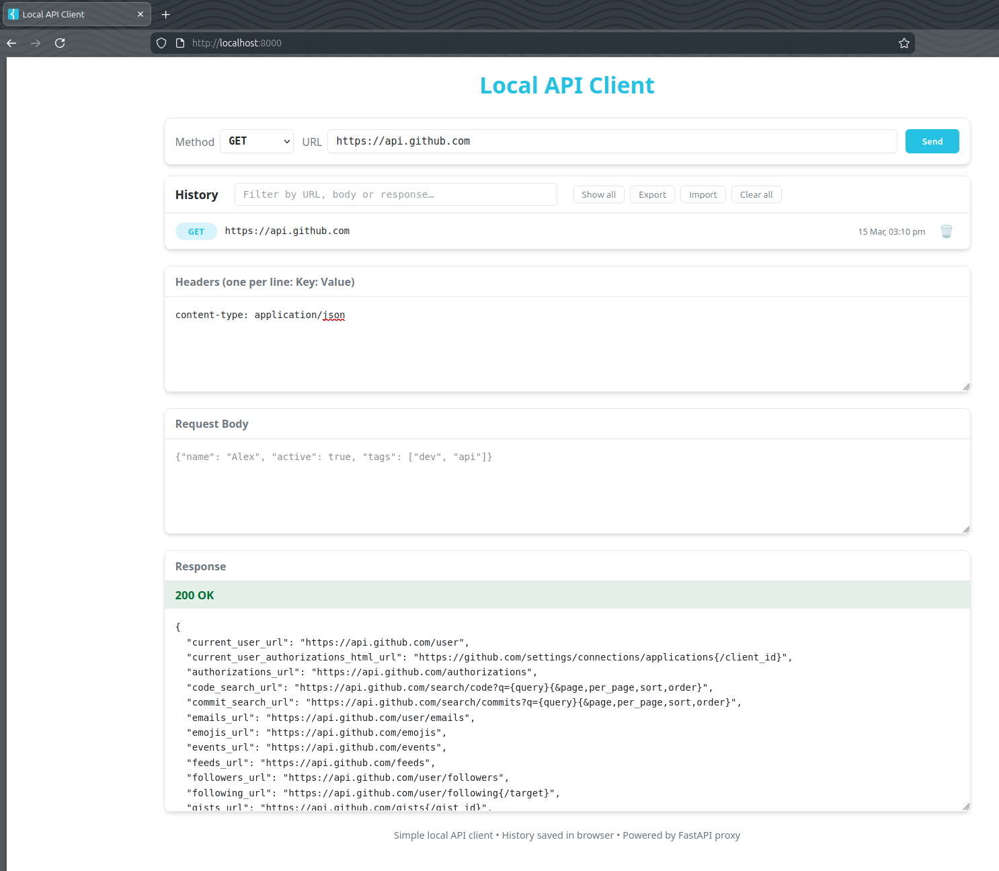

# Local API Client

Simple browser-based API client that runs **100% locally**  
Frontend ↔ FastAPI proxy (no CORS issues)

## Why use it?

*   Everything stays on your machine — no cloud service, no tracking
*   Bypasses browser CORS restrictions via a tiny FastAPI proxy
*   Persistent request history saved in the browser (localStorage)
*   Very lightweight — single HTML file + minimal Python backend
*   Good alternative when you want something faster/lighter than Postman/Insomnia for quick tests

## Features

*   GET / POST / PUT / PATCH / DELETE
*   Custom headers (one per line: `Key: Value`)
*   Request body (JSON or text — textarea)
*   Pretty-printed JSON response + status code / text
*   **History**:
    *   Automatically saves successful requests
    *   Click item → reloads method, URL, headers, body and last response
    *   Filter by URL / body / response content
    *   Show recent / show all toggle
    *   Delete single items (🗑 button)
    *   Import / Export history as JSON file — great for backup or sharing API requests
*   Keyboard shortcut: **Ctrl + Enter** (or Cmd + Enter on Mac) to send request
*   Enter key in URL / headers / body fields also sends (no Ctrl needed)

## Screenshots

(Place images in a `screenshots/` folder in the repository)

### Main interface

## Setup (recommended: virtual environment)

1.  Clone or download the repository

    git clone https://github.com/your-username/local-api-client.git
    cd local-api-client

1.  Create and activate virtual environment

**Windows (Command Prompt / PowerShell):**

    python -m venv .venv
    .venv\Scripts\activate

**macOS / Linux / Git Bash:**

    python3 -m venv .venv
    source .venv/bin/activate

1.  Install dependencies

    pip install fastapi uvicorn httpx pydantic

(or if you have `requirements.txt`):

    pip install -r requirements.txt

1.  **Important** — edit `whitelist.json` before starting

Only domains listed here are allowed through the proxy.

Example:

    [
      "api.github.com",
      "httpbin.org",
      "localhost",
      "127.0.0.1",
      "jsonplaceholder.typicode.com",
      "your-api.company.com"
    ]

*   Wildcards like `*.example.com` are supported
*   Changes require server restart

1.  Start the server

    uvicorn main:app --reload --port 8000

1.  Open in browser

    http://localhost:8000/

## Security & Usage Notes

**This tool is for local / personal development use only.**

*   The proxy is intentionally restricted via `whitelist.json`
*   Basic in-memory rate limiting exists (6 req / 60 s per IP) — not suitable for public exposure
*   **Do not** expose this server publicly — even temporarily
*   No authentication / advanced abuse protection
*   For real/sensitive API keys use dedicated tools with better security (Postman, Insomnia, Bruno, curl, etc.)

## Tech stack

*   Frontend: single-file HTML + CSS + vanilla JavaScript
*   Backend: FastAPI + httpx (async HTTP client)
*   History persistence: browser localStorage

Enjoy testing APIs locally!

Vibe-coded together with Grok • xAI